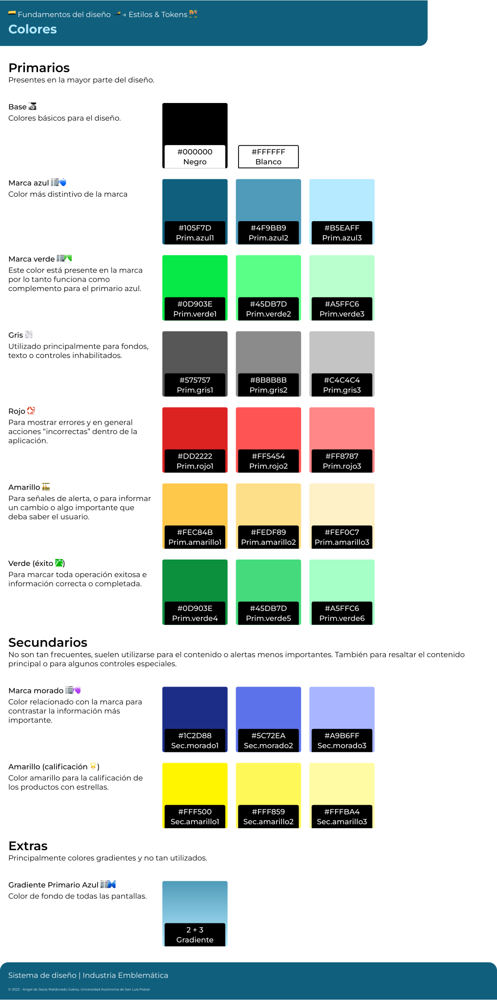
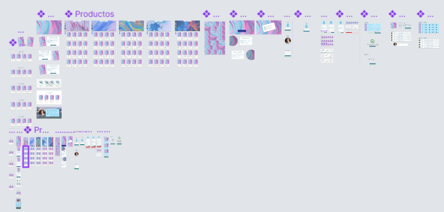
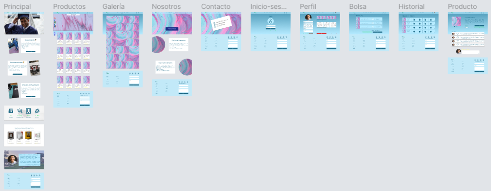

# README

## Sistema de diseño

### Atomic Design

El sistema de diseño utilizado para el proyecto es **Atomic Design** el cual se basa en la construcción de las páginas finales mediante **átomos->moléculas->organismos->plantillas->páginas**. Las unidades más pequeñas son los valores de estilo como clores, tipografía, sombreados, etc. Por lo tanto también estos tienen su propio apartado. Para la implementación del diseño en CSS se utiliza la metodología [ABEM](https://css-tricks.com/abem-useful-adaptation-bem/)

## 🖌 Estilos

> Los estilos identificados solamente fueron los colores, tipografía y sombras. Para los colores se dividieron en las categorías **Principales**, **Secundarios** y **Extras**, las sombras solamente se dividieron en **Interiores** y **Exteriores**.

### 🎨 Colores



### 🖊️ Tipografía


### 🪄 Sombras

.svg>)

### 🎴 Logo


## 🧩 Componentes

> Todos los componentes están divididos en las categorías correspondientes al sistema de diseño **Atomic Design**.

### 🧫 Átomos

#### 🖼️ Íconos


#### 🎮 Botones


#### 📸 Cards


#### 📝️ Elementos de listas y controles


### 🧬 Moléculas

#### 🃏 Cards


#### ⌨️️️ Entradas de texto


#### 📝 Controles y listas


### ⚗️ Organismos

#### 🪧 Sliders


#### 🖱️ Barras de navegación


### 📃 Plantillas + Páginas (Mockup)

> Las últimas 2 etapas del diseño estan englobadas en el **mockup**, las plantillas tienen su propia página en el archivo de Figma, pero finalmente el prototipo muestra el diseño interactivo final del producto.

#### 🧱 Plantillas

En esta página de **Figma** se muestran todas las pantallas pensadas para el diseño.

[](https://www.figma.com/file/4th7Y10THp7pcaydZHEvAE/Dise%C3%B1o?node-id=455:3745)

#### 🪄 Páginas (Mockup)

Página en figma.

[](https://www.figma.com/file/4th7Y10THp7pcaydZHEvAE/Dise%C3%B1o?node-id=550:24445)

Prototipo interactivo.

[](https://www.figma.com/proto/4th7Y10THp7pcaydZHEvAE/Dise%C3%B1o?node-id=550:24447\&page-id=550:24445\&scaling=contain\&starting-point-node-id=558:29485\&viewport=880,1106,1.02)

## Arquitectura MVC

> Para este proyecto se utiliza la arquitectura **MVC (Model View Controller)**.\
> Esta arquitectura esta pensada para manejar diferentes aspectos de una aplicación en desarrollo. Funciona principalmente para separar la capa de _**presentación**_ (**front**) de la capa de lógica del _**negocio**_ (**back**). Es la arquitectura más popular en el desarrollo web y de aplicaciones.

Los 3 componentes que describen este patrón de diseño son:

1. **Modelo**: almacena y maneja la información de una base de datos.
2. **View**: se encarga de la interfaz gráfica y las pantallas con las que el usuario final va a interactuar y las que mostrarán la información del _modelo_.
3. Controlador: es el _cerebro_ de la aplicación, este componente conecta el _modelo_ y la _vista_. El controlador convierte entradas de la capa de _vista_ en peticiones para obtener o actualizar la información del _modelo_.


### Arquitectura en MVC en el proyecto

La arquitectura para el proyecto es la siguiente:

````
```
project
|
└───assets
|    |
│    └───css
|    |    |    archivos .css...
|    |
|    └───img
|    |    |    archivos .jpg, .png, .webp, etc...
|    |
|    └───js
|        |    archivos .js...
|
└───controllers
|    |    archivos .php (para capa controller)...
|
└───docs
|    |
|    └───.gitbook
|    |    |    archivos .jpg, .png, .svg, etc...
|    |
|    |    README.md
|    |    SUMMARY.md
|
└───models
|    |    archivos .php (para capa model)...
|
└───views
|    |
|    └───layouts
|    |    |    archivos .php (que definen distribución de la vista)...
|    |
|    |    archivos .php (para capa de la vista)...
|
|    .gitbook.yaml
|    index.html
```
````

\
